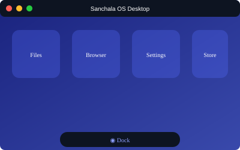
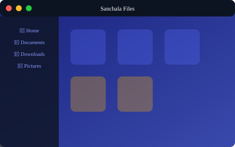
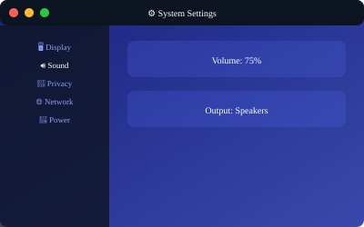
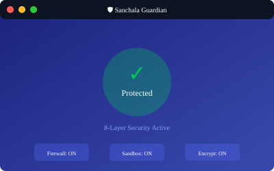
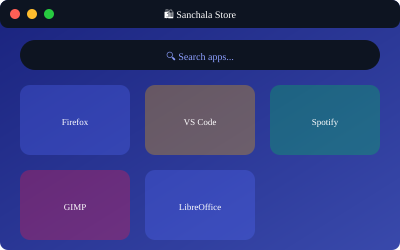

<div align="center">

# ◉ SANCHALA OS

### v1.0 "Astra" ⚡

### संञ्चल — "Set Your System in Motion"


[](https://github.com/dansiapa/sanchala-os/releases)
[](https://archlinux.org)
[](https://kde.org)
[](docs/security/SECURITY.md)

**A beautiful, secure, and powerful Linux distribution**

> *"Astra (अस्त्र) — The Divine Weapon of Digital Freedom"*

[Features](#-features) • [Screenshots](#-screenshots) • [Download](#-download) • [Documentation](#-documentation) • [Contributing](#-contributing)

---

</div>

## 🌟 The NAWALA Ecosystem

<div align="center">

```
╭─────────────────────────────────────────────────────────────────────────╮
│                                                                         │
│                        NAWALA ECOSYSTEM                                 │
│              Sanskrit-inspired Modern Infrastructure                    │
│                                                                         │
│    ┌───────────────┐   ┌───────────────┐   ┌───────────────┐           │
│    │   SANCHALA    │   │    NAWALA     │   │    RAKSHA     │           │
│    │      OS       │   │    Gateway    │   │   Security    │           │
│    │     संञ्चल     │   │      नवल      │   │     रक्षा     │           │
│    │               │   │               │   │               │           │
│    │  "Jalankan"   │   │   "Pesan"     │   │  "Lindungi"   │           │
│    │  Foundation   │   │   API Mgmt    │   │   Monitoring  │           │
│    └───────────────┘   └───────────────┘   └───────────────┘           │
│                                                                         │
╰─────────────────────────────────────────────────────────────────────────╯
```

</div>

---

## ✨ Features

<table>
<tr>
<td width="50%">

### 🎨 Beautiful Design
- **macOS-inspired UI** with KDE Plasma 6
- Floating dock with smooth magnification
- Global menu bar (top panel)
- Traffic light window buttons
- Blur effects & rounded corners
- 60fps smooth animations
- Dark/Light themes with auto-switch

</td>
<td width="50%">

### 🔒 Security Beyond Apple
- **8-layer security architecture**
- Hardened Linux kernel
- Mandatory AppArmor sandboxing
- TPM 2.0 & Secure Boot
- Full disk encryption (LUKS2)
- Permission system (better than macOS TCC)
- Post-quantum cryptography ready

</td>
</tr>
<tr>
<td width="50%">

### 📦 100% Linux Compatible
- **Flatpak** — Primary (sandboxed)
- **Pacman** — System packages
- **AUR** — Community packages
- **AppImage** — Auto-sandboxed
- No custom format needed!
- All your favorite apps work

</td>
<td width="50%">

### 🔄 Reliable & Recoverable
- **Btrfs snapshots** before updates
- Boot to previous snapshot
- Automatic security updates
- Easy rollback from GRUB
- Delta updates for efficiency
- Factory reset (keeps /home)

</td>
</tr>
</table>

---

## 🛡️ Security Architecture

<div align="center">

```
┌─────────────────────────────────────────────────────────────────────┐
│                    SANCHALA SECURITY LAYERS                         │
├─────────────────────────────────────────────────────────────────────┤
│  Layer 8  │  Zero Trust Network    │  WireGuard, mTLS, DoH         │
│  Layer 7  │  Application Security  │  Sandbox, TCC Permissions     │
│  Layer 6  │  Code Integrity        │  Signing, Verification        │
│  Layer 5  │  Memory Protection     │  CFI, ASLR, Stack Protection  │
│  Layer 4  │  Kernel Fortress       │  Hardened, LKRG, Lockdown     │
│  Layer 3  │  System Integrity      │  Immutable Root, IMA/EVM      │
│  Layer 2  │  Data Protection       │  LUKS2, TPM, fscrypt          │
│  Layer 1  │  Secure Boot           │  UEFI, Measured Boot, UKI     │
│  Layer 0  │  Hardware Security     │  TPM 2.0, IOMMU, HSM          │
└─────────────────────────────────────────────────────────────────────┘
```

</div>

### 🆚 Security Comparison

| Feature | Apple macOS | SANCHALA OS | Winner |
|---------|-------------|-------------|--------|
| Open Source | ❌ | ✅ | 🏆 SANCHALA |
| Kernel Hardening | Good | Excellent | 🏆 SANCHALA |
| App Sandboxing | ✅ | ✅ (More granular) | 🏆 SANCHALA |
| Permission System | TCC | Sanchala TCC (18+ categories) | 🏆 SANCHALA |
| Telemetry | ON by default | OFF by default | 🏆 SANCHALA |
| Post-Quantum Crypto | ❌ | ✅ Ready | 🏆 SANCHALA |
| Full Audit Trail | ❌ | ✅ | 🏆 SANCHALA |
| Supply Chain Security | Notarization | Reproducible builds + SLSA | 🏆 SANCHALA |

---

## 🖼️ Screenshots

<div align="center">

| Desktop | App Launcher | File Manager |
|---------|--------------|---------------|
|  |  |  |

| Settings | Security Center | App Store |
|----------|-----------------|------------|
|  |  |  |

</div>

---

## 📥 Download

### Latest Release: **Sanchala OS 1.0 "Gati"**

| Edition | Description | Download |
|---------|-------------|----------|
| **Standard** | Full desktop experience | [Download ISO](https://github.com/dansiapa/sanchala-os/releases) |
| **Minimal** | Base system + minimal DE | Coming Soon |
| **Server** | No GUI, security focused | Coming Soon |

### System Requirements

| Component | Minimum | Recommended |
|-----------|---------|-------------|
| CPU | 64-bit, 2 cores | 64-bit, 4+ cores |
| RAM | 4 GB | 8 GB+ |
| Storage | 30 GB | 50 GB+ SSD |
| TPM | - | TPM 2.0 (for full security) |
| Boot | UEFI | UEFI with Secure Boot |

---

## 🚀 Quick Start

### Option 1: Download ISO (Recommended)

```bash
# Download latest ISO
wget https://github.com/dansiapa/sanchala-os/releases/download/v1.0/sanchala-1.0-gati-x86_64.iso

# Verify signature
gpg --verify sanchala-1.0-gati-x86_64.iso.sig

# Create bootable USB
sudo dd if=sanchala-1.0-gati-x86_64.iso of=/dev/sdX bs=4M status=progress
```

### Option 2: Build from Source

```bash
# Clone repository
git clone https://github.com/dansiapa/sanchala-os.git
cd sanchala-os

# Install dependencies (on Arch Linux)
sudo pacman -S arch-install-scripts mtools squashfs-tools xorriso e2fsprogs git pv

# Build ISO
sudo ./iso/build-binary

# ISO will be in ./out/sanchala-<version>.iso
```

---

## ⌨️ Keyboard Shortcuts

> Standard Linux/Windows shortcuts — no weird Cmd key!

| Action | Shortcut |
|--------|----------|
| Copy / Paste / Cut | `Ctrl+C` / `Ctrl+V` / `Ctrl+X` |
| Undo / Redo | `Ctrl+Z` / `Ctrl+Y` |
| Save / Find | `Ctrl+S` / `Ctrl+F` |
| Close Window / App | `Ctrl+W` / `Ctrl+Q` |
| Switch Apps | `Alt+Tab` |
| App Launcher | `Super` (Windows key) |
| Lock Screen | `Super+L` |
| Terminal | `Ctrl+Alt+T` |
| File Manager | `Super+E` |
| Screenshot | `Print` |
| Screenshot (region) | `Shift+Print` |

---

## 📁 Project Structure

```
sanchala-os/
├── 📂 iso/                     # ISO Builder
│   ├── build-binary            # Main build script
│   ├── packages/               # Package lists
│   └── airootfs/               # Live system overlay
│
├── 📂 filesystem/              # OS Identity
│   ├── os-release              # System identification
│   ├── lsb-release             # LSB info
│   └── logos/                  # System logos
│
├── 📂 pkgbuilds/               # Custom Packages
│   ├── sanchala-filesystem/    # Core identity package
│   ├── sanchala-settings/      # Desktop configuration
│   ├── sanchala-guardian/      # Security center
│   └── ...                     # More packages
│
├── 📂 security/                # Security Configurations
│   ├── kernel/                 # Kernel hardening
│   ├── apparmor/               # AppArmor profiles
│   ├── firewall/               # Firewall rules
│   └── sandbox/                # Sandbox profiles
│
├── 📂 settings/                # Default User Settings
│   └── etc/skel/               # Skeleton home directory
│
├── 📂 branding/                # Visual Assets
│   ├── logos/                  # Logos (SVG, PNG)
│   ├── wallpapers/             # Default wallpapers
│   └── mockups/                # UI mockups
│
├── 📂 tools/                   # Custom Applications
│   ├── sanchala-guardian/      # Security daemon
│   ├── sanchala-store/         # App store
│   └── sanchala-welcome/       # Welcome app
│
├── 📂 installer/               # Calamares Installer
│   ├── branding/               # Installer branding
│   └── modules/                # Installer modules
│
└── 📂 docs/                    # Documentation
    ├── user-guide/             # User documentation
    ├── developer/              # Developer docs
    └── security/               # Security docs
```

---

## 🎨 Branding

### Color Palette

<div align="center">

| Color | Hex | Preview | Usage |
|-------|-----|---------|-------|
| Sanchala Indigo | `#3949AB` |  | Primary |
| Deep Navy | `#1A237E` |  | Dark/Headers |
| Electric Blue | `#536DFE` |  | Accent/Links |
| Golden Amber | `#FFB300` |  | Highlights |
| Success Green | `#00C853` |  | Success |
| Alert Red | `#FF1744` |  | Errors |

</div>

### Release Codenames (Sanskrit)

| Version | Codename | Meaning | Status |
|---------|----------|---------|--------|
| 1.0 | **Astra** ⚡ | Divine Weapon / Star | 🟢 Current |

---

## 📚 Documentation

- 📖 [User Guide](docs/user-guide/README.md) — Getting started
- 💿 [Installation Guide](docs/user-guide/INSTALLATION.md) — Install Sanchala OS
- 🔒 [Security Guide](docs/security/SECURITY.md) — Security features explained
- 🛠️ [Developer Guide](docs/developer/README.md) — Contributing to Sanchala
- 🏗️ [Architecture](docs/ARCHITECTURE.md) — System design and components
- ❓ [FAQ](docs/FAQ.md) — Frequently asked questions

---

## 🤝 Contributing

We welcome contributions! Please see our [Contributing Guide](CONTRIBUTING.md) and [Code of Conduct](CODE_OF_CONDUCT.md).

```bash
# Fork the repo, then:
git clone https://github.com/YOUR_USERNAME/sanchala-os.git
cd sanchala-os
git checkout -b feature/your-feature

# Make your changes, then:
git commit -m "feat: add amazing feature"
git push origin feature/your-feature

# Open a Pull Request!
```

---

## 🔗 Links

<div align="center">

| Resource | Link |
|----------|------|
| 🌐 Website | [sanchala.id](https://sanchala.id) |
| 📚 Documentation | [docs.sanchala.id](https://docs.sanchala.id) |
| 💬 Forum | [forum.sanchala.id](https://forum.sanchala.id) |
| 🐛 Issues | [GitHub Issues](https://github.com/dansiapa/sanchala-os/issues) |
| 🐦 Twitter | [@SanchalaOS](https://twitter.com/SanchalaOS) |

</div>

---

## 🙏 Acknowledgments

- [Arch Linux](https://archlinux.org) — The best base distribution
- [KDE Plasma](https://kde.org) — Beautiful desktop environment
- [PearOS](https://github.com/pear-os) — UI/UX inspiration
- All open source contributors

---

<div align="center">

### 🚀 SANCHALA OS

**"Set Your System in Motion"**

Part of the **NAWALA Ecosystem**

Sanskrit-inspired tools for modern infrastructure

---

<sub>© 2026 nawala-team</sub>

</div>
